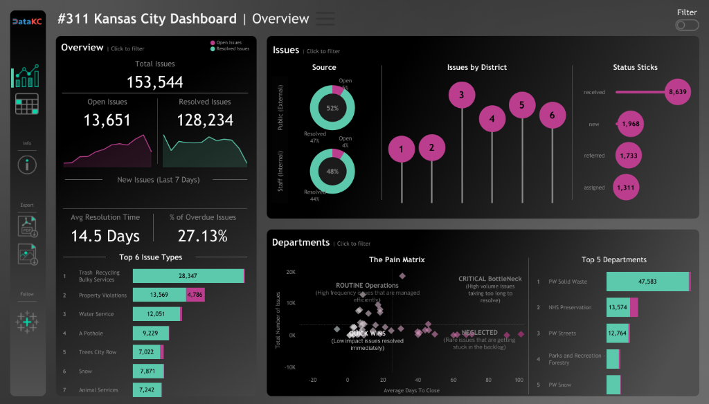
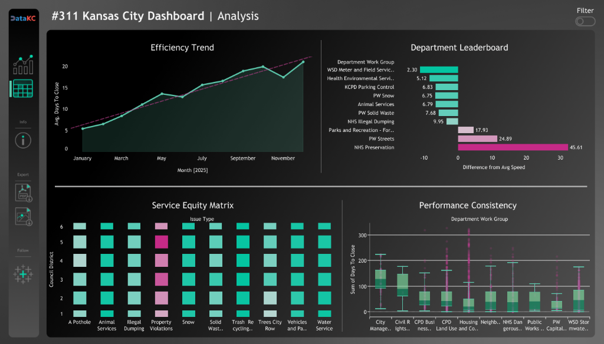

# 📊 Dashboard User Guide

> **A guide for understanding and using the Kansas City 311 Insight Engine Dashboard**

**🔗 [Open Live Dashboard](https://public.tableau.com/app/profile/nithin.reddy7249/viz/311Dashboard_17628123247790/311Overview)**

---

## Table of Contents
- [Who Is This For?](#who-is-this-for)
- [Overview Page](#overview-page)
- [Analysis Page](#analysis-page)
- [How to Use Filters](#how-to-use-filters)
- [Use Cases by Role](#use-cases-by-role)
- [Actionable Insights](#actionable-insights)

---

## Who Is This For?

This dashboard serves two primary audiences:

| Audience | What They Need |
|----------|---------------|
| 👤 **Kansas City Residents** | Understand how the city handles service requests, see what issues are common in their district, and track resolution times |
| 👨‍💼 **City Planners & Department Managers** | Identify bottlenecks, allocate resources efficiently, ensure equitable service across districts, and measure department performance |

---

## Overview Page

The Overview page provides a **high-level health check** of Kansas City's 311 service operations.

### Key Performance Indicators (KPIs)

| Metric | What It Tells You |
|--------|-------------------|
| **Total Issues (153,544)** | Total service requests processed in the dataset |
| **Open Issues (13,651)** | Requests currently being worked on |
| **Resolved Issues (128,234)** | Successfully closed requests |
| **Avg Resolution Time (14.5 Days)** | How long it typically takes to resolve a request |
| **% Overdue (27.13%)** | Percentage of issues exceeding expected resolution time |

### Visualizations Explained

#### 1. Source (Donut Chart)
**Purpose:** Shows where requests originate from.
- **Public (External) - 52%**: Reported by residents via phone, app, or web
- **Staff (Internal) - 48%**: Identified by city employees during inspections

**Why it matters:** A balanced split indicates good proactive city monitoring alongside resident engagement.

---

#### 2. Issues by District (Lollipop Chart)
**Purpose:** Compares request volume across Kansas City's 6 Council Districts.

**How to read it:** Larger circles = more requests from that district.

**Why it matters:** Helps identify if certain districts are underreporting issues (potential access gap) or experiencing more problems (infrastructure needs).

---

#### 3. Top 6 Issue Types (Bar Chart)
**Purpose:** Ranks the most frequent complaint categories.

| Rank | Issue Type | Volume |
|------|-----------|--------|
| 1 | Trash/Recycling/Bulky Services | 28,347 |
| 2 | Property Violations | 13,569 |
| 3 | Water Service | 12,051 |
| 4 | Pothole | 9,229 |
| 5 | Trees/City Row | 7,022 |
| 6 | Snow | 7,871 |

**Why it matters:** Reveals which services drive the most workload and may need more resources.

---

#### 4. The Pain Matrix (Quadrant Analysis)
**Purpose:** This is the most strategic chart — it categorizes issue types by **volume** vs. **resolution speed**.

| Quadrant | Meaning | Action |
|----------|---------|--------|
| **Routine Operations** (Top-Left) | High volume, fast resolution | ✅ Working well — maintain current approach |
| **Critical Bottlenecks** (Top-Right) | High volume, slow resolution | 🚨 **Priority attention needed** — these hurt the most residents |
| **Quick Wins** (Bottom-Left) | Low volume, fast resolution | ✅ Efficient handling of niche issues |
| **Neglected** (Bottom-Right) | Low volume, slow resolution | ⚠️ Rare issues getting stuck — investigate why |

**Why it matters:** Department managers can instantly see where to focus improvement efforts.

---

#### 5. Top 5 Departments (Bar Chart)
**Purpose:** Shows workload distribution among city departments.

**Why it matters:** Identifies which departments handle the majority of requests and may need additional staffing.

---

## Analysis Page

The Analysis page provides **deep-dive analytics** for performance monitoring and equity analysis.

### Visualizations Explained

#### 1. Efficiency Trend (Area Line Chart)
**Purpose:** Tracks average resolution time over months.

**How to read it:** 
- Rising line = Resolution times getting slower
- Dropping line = Improvements in efficiency

**Why it matters:** Reveals seasonal patterns (e.g., snow-related delays in winter) and long-term performance trends.

---

#### 2. Department Leaderboard (Diverging Bar Chart)
**Purpose:** Compares each department's speed against the citywide average.

**How to read it:**
- **Bars to the LEFT** (shorter values) = Faster than average 🏆
- **Bars to the RIGHT** (larger values) = Slower than average ⚠️

| Fast Performers | Slow Performers |
|-----------------|-----------------|
| WSD Meter and Field Services (2.30 days) | PW Streets (24.89 days) |
| Health Environmental Services (5.12 days) | NHS Preservation (45.61 days) |

**Why it matters:** Creates healthy accountability and identifies departments needing process improvements.

---

#### 3. Service Equity Matrix (Heatmap)
**Purpose:** Reveals if certain districts receive slower service for the same issue types.

**How to read it:**
- Rows = Issue Types
- Columns = Council Districts (1-6)
- Color intensity = Average days to close (darker = slower)

**Why it matters:** This is a **civic equity analysis** — ensuring all neighborhoods receive fair service regardless of location. If District 4 residents wait 3x longer for pothole repairs than District 1, that's an equity issue.

---

#### 4. Performance Consistency (Box Plot)
**Purpose:** Shows the *variance* in resolution times within each department.

**How to read it:**
- Tight cluster of dots = Consistent performance
- Wide spread of dots = Unpredictable service delivery

**Why it matters:** A department might have a "good average" but hide extreme outliers. This chart exposes inconsistency.

---

## How to Use Filters

Click the **Filter** toggle (top-right) to slice the dashboard by:

| Filter | Use Case |
|--------|----------|
| **Council District** | "Show me only issues from my neighborhood (District 3)" |
| **Request Status** | "Show me only Open issues to see current backlog" |
| **Source** | "Show me only resident-reported issues" |

> 💡 **Tip:** Filters apply to ALL charts on the page simultaneously.

---

## Use Cases by Role

### 👤 As a Kansas City Resident

| Question | Where to Look |
|----------|--------------|
| "What are the most common issues in my area?" | Issues by District + Top Issue Types |
| "How long will it take to fix my pothole?" | Avg Resolution Time KPI + Efficiency Trend |
| "Is my district getting fair service?" | Service Equity Matrix |

### 👨‍💼 As a City Planner / Department Manager

| Question | Where to Look |
|----------|--------------|
| "Which issues need the most attention?" | The Pain Matrix (Critical Bottlenecks quadrant) |
| "Which departments are underperforming?" | Department Leaderboard |
| "Are we serving all districts equally?" | Service Equity Matrix |
| "Is our performance improving over time?" | Efficiency Trend |
| "Which departments have inconsistent service?" | Performance Consistency box plot |

---

## Actionable Insights

This dashboard enables data-driven decisions such as:

1. **Resource Allocation**
   - If "Trash/Recycling" dominates volume, evaluate if PW Solid Waste needs more trucks or staff

2. **Process Improvement**
   - Departments in the "slow" side of the Leaderboard should audit their workflows

3. **Equity Audits**
   - If the Equity Matrix shows uneven service, investigate if it's due to staffing, geography, or systemic issues

4. **Seasonal Planning**
   - Efficiency Trend showing winter spikes? Pre-position snow removal resources

5. **Resident Communication**
   - Use resolution time data to set realistic expectations when residents file requests

---

## About This Project

This dashboard is part of the **Kansas City 311 Insight Engine** — a data engineering project that automates data ingestion from Kansas City's Open Data Portal into Google BigQuery for analysis.

**Author:** Nithin Reddy  
**Repository:** [GitHub](https://github.com/reddy-nithin/-311-KC-Dashboard)
